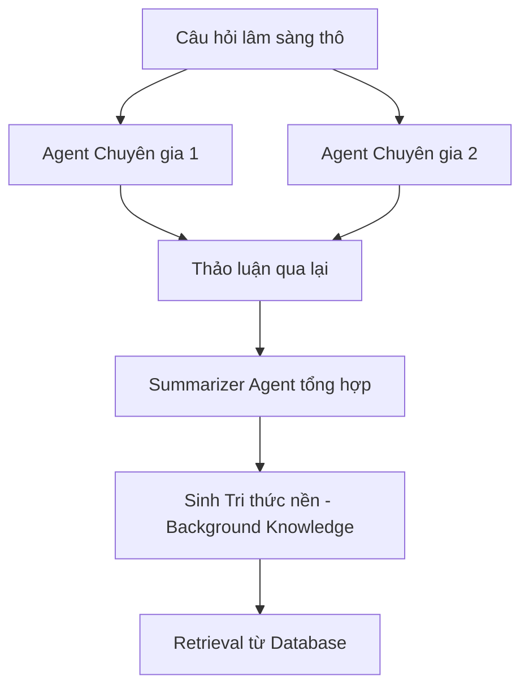

# Định hướng Nghiên cứu & Cải tiến Modular RAG Lâm sàng (future_research_directions.md)

Tài liệu này hệ thống hóa các phương pháp nghiên cứu cải tiến hệ thống RAG lâm sàng (ngoài hướng đi Fine-tune LLM), đối chiếu trực tiếp với các mô hình và lý thuyết từ các nghiên cứu SOTA (như **MedTrustRAG**, **Biomedical Query Expansion**, **Self-Correction RAG**, **Discuss-RAG**).

---

## 1. Bản đồ Đối chiếu Phương pháp Nghiên cứu (Research Method Mapping)

Dưới đây là bảng đối chiếu giữa các cấu phần RAG hiện tại, khoảng trống nghiên cứu (Research Gap), phương pháp cải tiến và bài báo học thuật đối chứng:

| Tầng Pipeline | Khoảng trống hiện tại (v0.1.0) | Phương pháp Cải tiến Đề xuất | Bài báo Học thuật Đối chứng | Lỗi kiểm soát (Lỗi 1-6) |
| :--- | :--- | :--- | :--- | :--- |
| **A. Tầng Phân tích**<br>*(Parser)* | Lệch từ vựng chuyên môn y khoa (như "medications" vs "pharmacological"). | **Biomedical Query Expansion & Knowledge-guided Transformation**: Sử dụng Ontology/Từ điển UMLS để tự động dịch và mở rộng câu hỏi bệnh nhân. | *UMLS-based Query Expansion in Clinical RAG* | **Lỗi 1 (Parser Error)** & **Lỗi 2 (Missing Evidence)** |
| **B. Tầng Tiền truy xuất & Phân tích**<br>*(Pre-Retrieval)* | Truy xuất trực tiếp bằng câu hỏi thô dễ gặp nhiễu hoặc thiếu thông tin nền. | **Multi-Agent Discussion & Summarization (Discuss-RAG)**: Cho các agent thảo luận để sinh tri thức nền trước khi truy xuất. | *Discuss-RAG* | **Lỗi 2 (Missing Evidence)** & **Lỗi 3 (Applicability)** |
| **C. Tầng Truy xuất**<br>*(Retrieval)* | BM25 và Vector cosine tĩnh dễ bỏ sót cấu trúc ngữ cảnh sâu. | **Multi-retriever Fusion (BM25 + MedCPT + Contriever + RRF)**: Kết hợp các bộ mã hóa thưa và dày chuyên biệt y sinh qua bộ lọc RRF. | *MedTrustRAG / Dense Passage Retrieval* | **Lỗi 2 (Missing Evidence)** |
| **D. Tầng Xếp hạng**<br>*(Reranking)* | Lỗi "Chống chỉ định ngược" (Concept Mention vs. Endorsement) do nhãn phẳng. | **Triple-based Relation Reranking**: Sử dụng cấu trúc bộ ba định hướng (`warns_against` / `recommends`) kết hợp đồ thị tri thức để rerank. | *MedTrustRAG (Safety & Context-sensitivity)* | **Lỗi 3 (Applicability Mismatch)** |
| **E. Tầng Tái cấu trúc Prompt**<br>*(Prompt Restructuring)* | Prompt gửi vào LLM sinh thô không bắt buộc tuân thủ nghiêm ngặt phác đồ điều trị. | **Guideline-Driven Prompt Restructuring**: Tái cấu trúc prompt tự động dựa trên hướng dẫn lâm sàng (guideline) và ontology để áp đặt ràng buộc y khoa cứng lên mô hình sinh. | *Constraint-guided Generation / Clinical Guideline Alignment* | **Lỗi 5 (Safety Violation)** |
| **F. Tầng Kiểm soát**<br>*(Verifier)* | Bộ lọc an toàn y khoa tĩnh bằng luật cứng (Hard-coded logic). | **Dual-Agent Verification / Iterative Retrieval-Verification Loop**: Trực tiếp phân tách vai trò của Generator và Verifier kết hợp sửa lỗi lặp. | *MedTrustRAG / Self-RAG / Corrective RAG* | **Lỗi 5 (Safety Violation)** & **Lỗi 6 (Decision Error)** |
| **G. Tầng Giám sát & Tracing**<br>*(Observability)* | Chưa có công cụ trực quan hóa luồng dữ liệu trung gian và đo đạc token/latency. | **RAG Observability & Tracing (LangSmith / Langfuse / Arize Phoenix)**: Tích hợp bộ ghi log và vẽ đồ thị thực thi để giám sát các bước Rerank, Parser, và Prompt Restructuring. | *LLM Observability and Evaluation Frameworks* | *Giám sát toàn diện 6 lỗi y khoa* |

---

## 2. Chi tiết các Hướng Nghiên cứu Mở rộng (Deep-Dive Research Directions)

### 2.1. Biomedical Query Expansion (Cải tiến Tầng Parser)
*   **Mô tả**: Khi người bệnh hỏi: *"Tôi bị loãng xương thì nên uống thuốc gì?"*, Parser hiện tại chỉ trích xuất được từ khóa `"medications"`.
*   **Giải pháp**: Tích hợp module truy vấn đồ thị Ontology để tự động suy luận:
    $$\text{Query}_{\text{expanded}} = \text{Query}_{\text{orig}} \cup \{\text{Bisphosphonates}, \text{Alendronate}, \text{Pharmacological therapy}\}$$
    giúp bộ tìm kiếm Vector dễ dàng so khớp với tài liệu đích `P004`.
*   **Đóng góp học thuật**: Giải quyết bài toán lệch pha từ vựng giữa ngôn ngữ người dân và ngôn ngữ học thuật của phác đồ điều trị.

### 2.2. Relation-aware Graph Reranker (Cải tiến Tầng Reranker)
*   **Mô tả**: Thay thế thuật toán so khớp Concept phẳng hiện tại bằng thuật toán duyệt đồ thị tri thức (Graph Walk).
*   **Giải pháp**:
    *   Xây dựng mối quan hệ có hướng trong đồ thị:
        $$\text{AcutePostFracture} \xrightarrow{\text{contraindicated\_for}} \text{HighImpactExercise}$$
        $$\text{P002} \xrightarrow{\text{warns\_against}} \text{HighImpactExercise}$$
    *   Thuật toán Rerank sẽ tính điểm phạt dựa trên sự giao thoa đường đi trên đồ thị (Graph Paths) thay vì so khớp từ khóa đơn thuần. Nếu tài liệu `P002` khớp cả hai đường đi cấm này, nó sẽ được xác nhận là tài liệu an toàn (phù hợp với chống chỉ định) và được cộng điểm ưu tiên.

### 2.3. Guideline-Driven Prompt Restructuring (Cải tiến Tầng Tái cấu trúc Prompt)
*   **Mô tả**: Mặc dù tài liệu y văn chính xác đã được truy xuất, LLM sinh (Generator) trong quá trình viết câu trả lời vẫn có thể "quên" hoặc diễn đạt lơ là các cảnh báo an toàn cốt lõi của phác đồ (Clinical Guidelines).
*   **Giải pháp**: Thiết lập module tái cấu trúc prompt tự động trước khi gọi LLM sinh. 
    1.  Module này sẽ nhận đầu vào gồm: *Câu hỏi bệnh nhân*, *Tài liệu y văn trích xuất*, và *Mối quan hệ chống chỉ định tương ứng từ Ontology*.
    2.  Hệ thống sẽ tái cấu trúc lại prompt sinh, nhúng trực tiếp các chỉ thị bắt buộc (Hard Constraints) ở phần đầu và phần cuối prompt:
        ```text
        [MỤC TIÊU LÂM SÀNG BẮT BUỘC]
        Bạn đang tư vấn cho bệnh nhân ở trạng thái: {clinical_state}.
        Dựa trên phác đồ (Guideline) được trích xuất, bạn BẮT BUỘC phải tuân thủ:
        - KHÔNG KHUYÊN hành động: {contraindicated_concept}
        - KHUYÊN và ưu tiên hành động: {recommended_concept}
        Mọi câu trả lời vi phạm chỉ thị trên sẽ bị hệ thống kiểm duyệt hủy bỏ.
        ```
*   **Đóng góp học thuật**: Chuyển dịch từ việc LLM sinh tự do sang cơ chế sinh có kiểm soát ràng buộc cứng (Constraint-guided Generation), đảm bảo câu trả lời luôn khớp 100% với phác đồ điều trị chuẩn của ngành y tế.

### 2.4. RAG Observability & Tracing (Tầng Giám sát và Đo đạc chất lượng)
*   **Mô tả**: RAG y khoa có kiến trúc phức tạp nhiều tầng (Parser -> Retrieval -> Reranker -> Generator -> Verifier). Khi xảy ra sai sót y khoa (ví dụ: khuyên sai chỉ định), rất khó để tìm ra lỗi xuất hiện ở tầng nào nếu chỉ quan sát câu trả lời cuối cùng.
*   **Giải pháp**: Tích hợp các thư viện giám sát tiến trình chuyên dụng:
    1.  **LangSmith**: Lưu trữ và vẽ sơ đồ cây thực thi (Execution Tree). Giúp giám sát chi tiết input/output của từng bước, đo lượng token sử dụng, và ghi nhận độ trễ (latency).
    2.  **Langfuse**: Phiên bản nguồn mở thay thế LangSmith, cho phép tự chạy server lưu trữ (self-host) để bảo mật dữ liệu y khoa của bệnh nhân.
    3.  **Arize Phoenix / LlamaTrace**: Tích hợp các bộ đánh giá tự động (Evals) để chấm điểm trực quan độ trung thực (Faithfulness) và Relevance ngay trên giao diện dashboard theo thời gian thực.
*   **Đóng góp học thuật**: Cung cấp khả năng "mở hộp đen" (Explainability) của hệ thống RAG, giúp các bác sĩ và chuyên gia giám sát có thể kiểm toán (audit) từng bước suy luận của AI.

#### Bảng so sánh lựa chọn công cụ: LangSmith vs Langfuse
Dưới đây là bảng so sánh cụ thể giữa hai công cụ giám sát RAG hàng đầu để phục vụ việc lựa chọn trong đề tài khóa luận:

| Tiêu chí so sánh | LangSmith (SaaS) | Langfuse (Open-source) | Khuyên dùng cho Khóa luận Lâm sàng |
| :--- | :--- | :--- | :--- |
| **Mô hình triển khai** | Chỉ chạy Cloud (SaaS của LangChain). | Hỗ trợ Cloud **và** Self-host (chạy Docker tại local). | **Langfuse** (Self-host bảo vệ dữ liệu bệnh nhân). |
| **Bảo mật & Quyền riêng tư** | Dữ liệu y văn và câu hỏi bệnh nhân phải gửi lên server LangChain. | Kiểm soát dữ liệu 100% khi chạy local, đạt tiêu chuẩn HIPAA y tế. | **Langfuse** (Dễ bảo vệ đề tài trước hội đồng khoa học). |
| **Khả năng tích hợp** | Tối ưu hóa cực mạnh nếu code dùng thư viện `LangChain`. | Không phụ thuộc vào framework (dùng code Python thuần, LlamaIndex đều mượt). | **Langfuse** (Thích hợp cho project code module thuần). |
| **Chi phí sử dụng** | Giới hạn gói Free (5000 traces/tháng), sau đó tính phí đắt. | Miễn phí hoàn toàn khi tự chạy Docker trên máy cá nhân/server riêng. | **Langfuse** (Phù hợp cho sinh viên nghiên cứu). |
| **Tính năng chính** | Prompt playground, dataset testing, feedback loop rất sâu. | Vẽ đồ thị trace trực quan, chấm điểm RAGAS trực tiếp trên UI. | **Ngang nhau** (Cả hai đều đáp ứng 100% nhu cầu). |

---

## 3. Bản tổng hợp Tri thức từ các Nghiên cứu Học thuật SOTA (MedTrustRAG & Discuss-RAG)

### 3.1. Nghiên cứu MedTrustRAG: Khung Đánh giá & Huấn luyện An toàn Lâm sàng

#### A. Kiến trúc Pipeline "Iterative Retrieval–Verification"
*   Hệ thống không chạy RAG một lượt (one-pass) mà chạy lặp:
    $$\text{Query} \rightarrow \text{Retrieve} \rightarrow \text{Verify} \rightarrow \text{Refine Query (nếu vi phạm)} \rightarrow \text{Re-retrieve}$$
*   Quá trình này lặp lại cho đến khi Verifier xác nhận bối cảnh hoàn toàn an toàn hoặc chuyển tuyến (`Escalate`).

#### B. Cơ chế Dual-Agent (Verifier + Generator)
*   **Generator Agent**: Tập trung tối đa vào việc đọc hiểu tài liệu và sinh câu trả lời mượt mà, dễ hiểu cho người bệnh.
*   **Verifier Agent**: Chạy độc lập, đóng vai trò "kiểm sát viên" đối chiếu câu phát biểu của Generator với danh sách chống chỉ định y khoa (đảm bảo tính khách quan lâm sàng).

#### C. Thiết kế Benchmark & Dữ liệu Huấn luyện (MedRankQA)
Để huấn luyện mô hình Verifier biết cách từ chối/cảnh báo an toàn, MedTrustRAG đề xuất phương pháp xây dựng tập dữ liệu **MedRankQA**:
*   **Cách tạo mẫu tích cực (Positive Samples)**:
    *   Lấy các cặp câu hỏi-tài liệu đúng từ y văn chuẩn, trong đó tài liệu hướng dẫn an toàn và đúng bối cảnh lâm sàng của bệnh nhân.
*   **Cách tạo 4 loại mẫu tiêu cực (Negative Samples)**:
    *   *Type 1 (Missing Evidence)*: Tài liệu đúng bị lược bỏ các thông tin cốt lõi, khiến câu trả lời không có căn cứ.
    *   *Type 2 (Applicability Mismatch)*: Tài liệu có từ khóa giống nhưng nói về một bệnh lý hoặc đối tượng bệnh nhân khác (lệch tính ứng dụng).
    *   *Type 3 (Contraindication Violation)*: Tài liệu khuyên thực hiện các hành động bị chống chỉ định trực tiếp bởi trạng thái lâm sàng của bệnh nhân.
    *   *Type 4 (Hallucinated Source)*: Tài liệu y văn bị xáo trộn nội dung hoặc tự bịa thông tin nguồn giả định.
*   **Huấn luyện bằng hàm loss DPO (Direct Preference Optimization)**:
    *   Verifier được tinh chỉnh để tối đa hóa điểm số của các mẫu tích cực (an toàn) và giảm thiểu điểm số của các mẫu tiêu cực (vi phạm):
        $$\mathcal{L}_{\text{DPO}}(\theta) = -\mathbb{E}_{(x, y_w, y_l)} \left[ \log \sigma \left( \beta \log \frac{\pi_\theta(y_w | x)}{\pi_{\text{ref}}(y_w | x)} - \text{score}(y_l | x) \right) \right]$$
        *(Trong đó $y_w$ là câu trả lời được Verifier phê duyệt an toàn, $y_l$ là câu trả lời bị phạt do vi phạm an toàn).*

#### D. Retrieval Stack nâng cao
*   Thay vì chỉ dùng BM25 hoặc Vector đơn lẻ, MedTrustRAG tích hợp:
    $$\text{Retrieval Stack} = \text{BM25} + \text{MedCPT (Embedding y sinh chuyên sâu)} + \text{Contriever}$$
*   Gộp kết quả bằng thuật toán **Reciprocal Rank Fusion (RRF)** để lấy điểm số tối ưu từ cả 3 nguồn tìm kiếm:
    $$RRF\_Score(d) = \sum_{m \in M} \frac{1}{k + r_m(d)}$$

---

### 3.2. Nghiên cứu Discuss-RAG: Thảo luận Đa tác nhân cải tiến Tri thức nền

Discuss-RAG đề xuất giải quyết bài toán thiếu thông tin nền bằng cách bổ sung hai bước cốt lõi trước và sau khi truy xuất:

#### Bước 1: Multi-agent Discussion (Thảo luận Đa tác nhân - Tiền truy xuất)

1.  **Multi-agent Discussion**: Nhiều Agent chuyên ngành (ví dụ: Agent giải phẫu, Agent dược lý, Agent phục hồi chức năng) cùng thảo luận xoay quanh câu hỏi của bệnh nhân.
2.  **Summarization**: Một Agent tổng hợp (Summarizer) đúc kết nội dung cuộc thảo luận thành một đoạn văn ngắn gọn.
3.  **Background Knowledge Generation**: Sinh ra tri thức nền định hướng (Background Knowledge).
4.  **Retrieval**: Sử dụng tri thức nền này làm Query mở rộng để tiến hành truy xuất từ Database, giúp kết quả tìm kiếm tập trung chính xác vào phác đồ chuyên khoa.

#### Bước 2: Decision Agent (Lọc nhiễu hậu truy xuất)
Sau khi truy xuất được tài liệu từ Database, một **Decision Agent** độc lập sẽ rà soát danh sách tài liệu trả về để phân loại:
*   **Đoạn văn hữu ích (Useful contexts)**: Được giữ lại và chuyển vào prompt cho LLM sinh câu trả lời.
*   **Đoạn văn gây nhiễu (Noisy/Irrelevant contexts)**: Bị loại bỏ lập tức để tránh làm loãng hoặc gây nhiễu suy luận của LLM.
